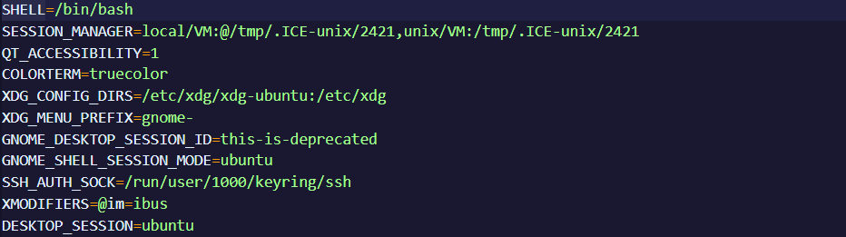

# Environment Variable and Set-UID Program Lab

## Task 1

- Através do comando `printenv` é possível listar todas as variáveis de ambiente do sistema.

- Experimentámos o comando `printenv PWD` para obter o path completo do diretório atual.


- Com o comando `export` foi possível criar uma variável no sistema.


## Task 2

- Após a compilação do ficheiro `myprintenv.c`, corremos e guardamos o seu output em `file` que contém uma lista completa das variáveis do processo filho.

- Após uma alteração no ficheiro `myprintenv.c` repetimos o processo guardando o output em `file2` que contém a lista de variáveis do processo pai.

- Tendo como objetivo descobrir se as variáveis de ambiente do processo pai são herdadas pelo processo filho, fez-se uma comparação entre os dois ficheiros com o seguinte comando:

```bash
diff file file2
```

- Um output vazio indica que não existem diferenças nos dois ficheiros concluindo então que as variáveis de ambiente são herdadas.


## Task 3

- Executar o ficheiro `myenv.c` gera um output vazio.


- Observando o comando `execve`, deduzimos que, por causa do terceiro parâmetro se encontrar a NULL, as variáveis de ambiente não são passadas.

```c
execve("/usr/bin/env", argv, NULL);
``` 

- Alterando esse parâmetro pela variável `environ`, o array passa a ser usado para passar as variáveis de ambiente.

```c
execve("/usr/bin/env", argv, environ);
``` 



## Task 4

- Usando o comando `system`, verificámos que foi criado um novo processo onde são passadas todas variaveis de ambiente do processo anterior.

- No caso de `execve` é mantido o processo atual e as mesmas variáveis de ambiente, substituindo o processo em execução pelo comando passado como argumento, que so mantém as variáveis de ambiente se estas forem passadas como argumento.

## Task 5

## Task 6

## Task 8


