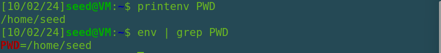

# Environment Variable and Set-UID Program Lab

## Task 1

- Através do comando `printenv` é possível listar todas as variáveis de ambiente do sistema.

- Experimentámos o comando `printenv PWD` para obter o path completo do diretório atual.



- Com o comando `export` foi possível criar uma variável no sistema.


## Task 2

- Após a compilação do ficheiro `myprintenv.c`, corremos e guardamos o seu output em `file` que contém uma lista completa das variáveis do processo filho.

- Após uma alteração no ficheiro `myprintenv.c` repetimos o processo guardando o output em `file2` que contém a lista de variáveis do processo pai.

- Tendo como objetivo descobrir se as variáveis de ambiente do processo pai são herdadas pelo processo filho, fez-se uma comparação entre os dois ficheiros com o seguinte comando:

```bash
diff file file2
```

- A falta de um output indica que não existem diferenças nos dois ficheiros concluindo então que as variáveis de ambiente são herdadas.

